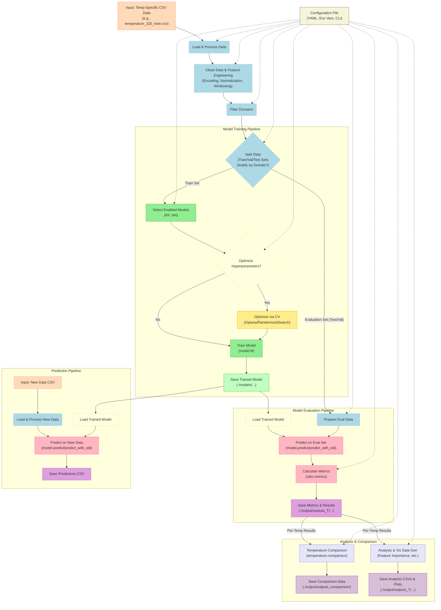
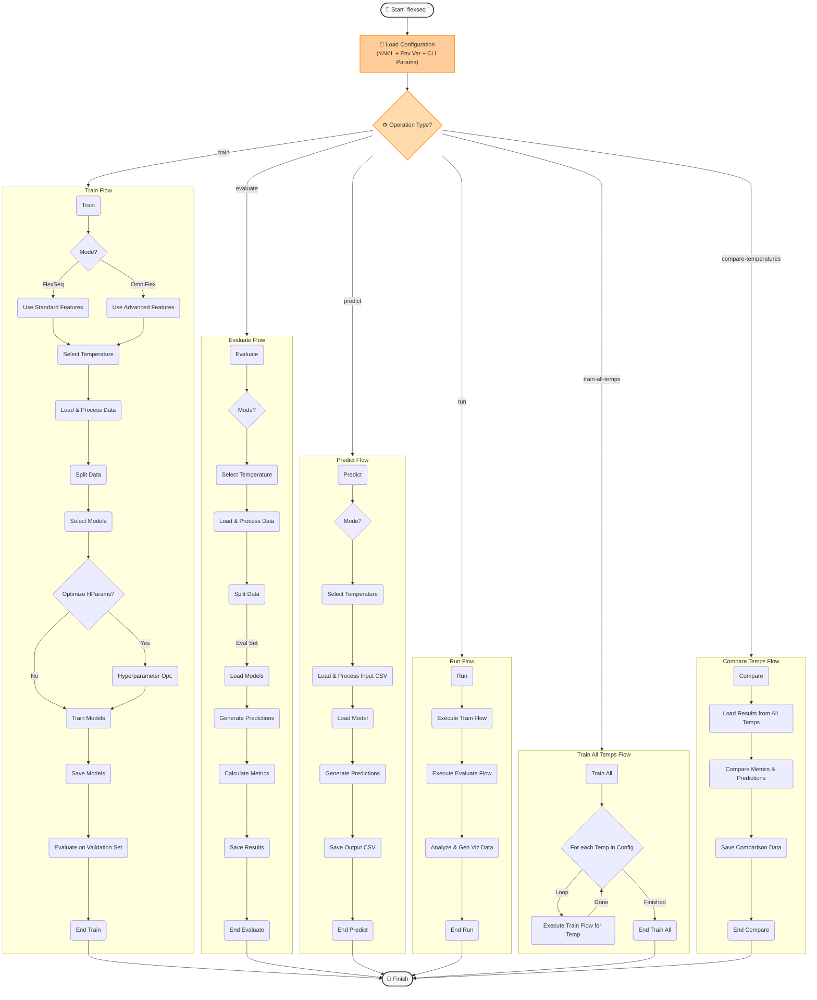

# FlexSeq: Protein Flexibility Prediction Pipeline 🧬🔍

<div align="center">


[](https://www.python.org/)
[](LICENSE)
[](CONTRIBUTING.md)
[](https://github.com/Felixburton7/flexseq)

**A comprehensive machine learning pipeline for predicting protein flexibility (RMSF) across multiple temperatures using sequence and structural features.**

[📊 Key Features](#key-features) •
[🔧 Installation](#installation) •
[🚀 Quick Start](#quick-start) •
[🔄 Pipeline Overview](#pipeline-overview) •
[📥 Input Data](#input-data) •
[📤 Output Data](#output-data) •
[🤖 Models](#models) •
[📈 Analysis & Visualization](#analysis--visualization) •
[⚙️ Configuration](#configuration) •
[💻 Command-Line Interface](#command-line-interface) •
[📚 Documentation](#documentation) •
[🤝 Contributing](#contributing)

</div>

## 🌟 Overview

FlexSeq is a machine learning pipeline meticulously designed for predicting protein flexibility, quantified as Root Mean Square Fluctuation (RMSF), based on protein sequence and structural features. A core capability of FlexSeq is its robust support for analyzing and comparing flexibility across a range of user-defined temperatures (e.g., 320K, 348K, 379K, 413K, 450K, and an averaged dataset), enabling the study of temperature-dependent dynamic behavior.

The pipeline offers two distinct operational modes, configurable via the `mode.active` setting:

-   **🔬 FlexSeq Mode**: The standard operational mode, utilizing a rich set of features derived directly from protein sequence and basic structural properties (e.g., protein size, residue position, solvent accessibility, secondary structure classification from DSSP, backbone dihedral angles φ/ψ).
-   **🔭 OmniFlex Mode**: An enhanced prediction mode that leverages the standard features *plus* pre-computed RMSF predictions derived from external, powerful models like ESM (Evolutionary Scale Modeling) embeddings (`esm_rmsf`) and potentially 3D voxel representations (`voxel_rmsf`), aiming for improved predictive accuracy.

FlexSeq employs a modular and configurable architecture, built upon Python libraries like Pandas, Scikit-learn, PyTorch, and Optuna. It features:
*   Configurable machine learning models (Random Forest and Neural Network).
*   Automated feature engineering, including sequence-window features and numerical encoding.
*   Comprehensive model evaluation using a suite of standard regression metrics.
*   Integrated hyperparameter optimization using Randomized Search (RF) or Optuna (NN).
*   Tools for systematic comparison of results across different temperatures.
*   Uncertainty estimation capabilities for model predictions.
*   A flexible and user-friendly Command-Line Interface (CLI) powered by Click.

## 📊 Key Features

<table>
<thead>
  <tr bgcolor="#6236FF">
    <th width="200"><span style="color:white">Feature</span></th>
    <th><span style="color:white">Description</span></th>
  </tr>
</thead>
<tbody>
  <tr>
    <td>🌡️ **Multi-Temperature Analysis**</td>
    <td>Train models, evaluate performance, and compare RMSF predictions across a user-defined list of temperatures (e.g., `[320, 348, 379, 413, 450, "average"]`).</td>
  </tr>
  <tr>
    <td>🤖 **Multiple ML Models**</td>
    <td>Includes Random Forest (Scikit-learn) and Feed-Forward Neural Network (PyTorch) implementations. The architecture allows for easy addition of new models inheriting from `BaseModel`.</td>
  </tr>
  <tr>
    <td>⚙️ **Feature Engineering**</td>
    <td>Automatic encoding of categorical features (residue name, core/exterior, secondary structure), normalization of angles (φ/ψ), calculation of normalized residue position, and optional generation of window-based features using neighboring residue information.</td>
  </tr>
  <tr>
    <td>🔬 **OmniFlex Mode**</td>
    <td>Optionally incorporates external predictions (`esm_rmsf`, `voxel_rmsf`) as input features for potentially enhanced performance. Enabled via configuration.</td>
  </tr>
  <tr>
    <td>⚠️ **Uncertainty Quantification**</td>
    <td>Models provide uncertainty estimates: standard deviation across trees for Random Forest, Monte Carlo Dropout sampling for Neural Network.</td>
  </tr>
  <tr>
    <td>📏 **Comprehensive Evaluation**</td>
    <td>Utilizes multiple metrics including RMSE, MAE, R², Pearson correlation, Spearman correlation, and Root Mean Square Absolute Error (RMSAE). Metrics are configurable.</td>
  </tr>
  <tr>
    <td>📊 **Analysis & Visualization**</td>
    <td>Generates detailed output CSV files for evaluation metrics, domain-level performance, residue-level errors (by AA type, position, structure), feature importance, and cross-temperature comparisons, suitable for external visualization tools. Also generates basic plots (e.g., feature importance).</td>
  </tr>
   <tr>
    <td>🧩 **Domain Stratification**</td>
    <td>Supports data splitting (`train`/`validation`/`test`) that ensures all residues from a given protein domain are kept within the same split, preventing data leakage between sets.</td>
  </tr>
  <tr>
    <td>🎯 **Hyperparameter Optimization**</td>
    <td>Automated tuning for both models using Scikit-learn's `RandomizedSearchCV` for Random Forest and Optuna (supporting random search and Bayesian optimization) for Neural Network. Configuration allows defining search spaces and trials.</td>
  </tr>
  <tr>
    <td>💻 **Command-Line Interface**</td>
    <td>Provides the `flexseq` command with subcommands (`train`, `evaluate`, `predict`, `run`, `compare-temperatures`, etc.) for easy pipeline execution and control.</td>
  </tr>
   <tr>
    <td>⚙️ **Configuration System**</td>
    <td>Highly flexible configuration via YAML (`default_config.yaml`), environment variables (prefixed `FLEXSEQ_`), and direct CLI parameter overrides (`--param`). Supports temperature templating in paths and column names.</td>
  </tr>
</tbody>
</table>

## 🔄 Pipeline Overview

The FlexSeq pipeline follows a structured workflow managed by the `Pipeline` class (`flexseq/pipeline.py`), driven by the configuration settings.

**Conceptual Workflow Diagram:**



### 🧩 Logical Flow of Operation (CLI Perspective)



## 🔧 Installation

### Prerequisites
*   Python 3.8 or higher
*   pip (Python package installer)

### Install from Source (Recommended)
```bash
# 1. Clone the repository
git clone https://github.com/Felixburton7/flexseq.git
cd flexseq

# 2. Install the package in editable mode
pip install -e .
```
*This installs the package such that changes to the source code are immediately reflected.*

### Dependencies
Core dependencies are managed by `setuptools` via `pyproject.toml` and `setup.py`. Key dependencies include:
`numpy`, `pandas`, `scikit-learn`, `torch`, `pyyaml`, `click`, `matplotlib`, `seaborn`, `joblib`, `tqdm`, `optuna`.

## 🚀 Quick Start

*(Run commands from the root directory: `/home/s_felix/flexseq`)*

### Basic Usage
```bash
# Train Random Forest model at 320K using default config
flexseq train --temperature 320 --model random_forest

# Evaluate the trained Random Forest model at 320K
flexseq evaluate --temperature 320 --model random_forest
# Check output in ./output/outputs_320/evaluation_results.csv

# Predict RMSF for new proteins at 320K using the best model
# (Assumes new_proteins.csv is in ./data and formatted correctly)
flexseq predict --input ./data/new_proteins.csv --temperature 320 --output ./output/new_proteins_pred_320.csv
```

### Advanced Usage
```bash
# Train Neural Network using OmniFlex mode at 348K
# (Requires esm_rmsf column in temperature_348_train.csv)
flexseq train --mode omniflex --temperature 348 --model neural_network

# Train enabled models on all available temperatures
flexseq train-all-temps

# Run the full pipeline (train, evaluate, analyze) for 379K
flexseq run --temperature 379

# Generate data comparing Random Forest results across all temperatures
flexseq compare-temperatures --model random_forest
# Check output in ./output/outputs_comparison/
```

## 📥 Input Data

FlexSeq expects temperature-specific CSV files in the data directory (`./data` by default).

*   **File Naming:** Defined by `dataset.file_pattern` in config (e.g., `temperature_320_train.csv`).
*   **Required Columns for Training:** `domain_id`, `resid`, `resname`, `rmsf_{temperature}`.
*   **Optional/Recommended Columns:** `protein_size`, `normalized_resid`, `core_exterior`, `relative_accessibility`, `dssp`, `phi`, `psi`.
*   **OmniFlex Mode Columns:** `esm_rmsf` (required if `use_esm: true`), `voxel_rmsf` (required if `use_voxel: true`).

| Column                      | Description                                             | Type    | Example        | Notes                                       |
| :-------------------------- | :------------------------------------------------------ | :------ | :------------- | :------------------------------------------ |
| `domain_id`                 | Protein domain identifier                             | string  | `1a0aA00`      | Used for grouping and stratified splitting |
| `resid`                     | Residue ID (position in chain)                        | int     | `42`           |                                             |
| `resname`                   | 3-letter amino acid code                                | string  | `ALA`          |                                             |
| `rmsf_{temperature}`        | **Target:** RMSF value at specified temperature       | float   | `0.835`        | e.g., `rmsf_320` for T=320K                 |
| `protein_size`              | *Feature:* Total # residues in protein/domain         | int     | `153`          | Calculated if missing                       |
| `normalized_resid`          | *Feature:* Residue pos. normalized to 0-1             | float   | `0.274`        | Calculated if missing                       |
| `core_exterior`             | *Source:* Location ('interior' or 'surface')          | string  | `surface`      | Encoded to `core_exterior_encoded`        |
| `relative_accessibility`    | *Feature:* Solvent accessibility measure              | float   | `0.65`         | Typically 0-1                               |
| `dssp`                      | *Source:* Secondary structure (DSSP codes)            | string  | `H`, `E`, `C`  | Encoded to `secondary_structure_encoded`    |
| `phi`, `psi`                | *Source:* Backbone dihedral angles (degrees)          | float   | `-65.3`, `120.7` | Normalized to `phi_norm`, `psi_norm`        |
| `resname_encoded`           | *Feature:* Numerical encoding of `resname`            | int     | `1`            | Generated if `resname` present              |
| `core_exterior_encoded`     | *Feature:* Binary encoding (0=core, 1=surface)        | int     | `1`            | Generated if `core_exterior` present        |
| `secondary_structure_encoded`| *Feature:* Numerical encoding of `dssp` (0=H, 1=E, 2=Loop)| int| `0`            | Generated if `dssp` present                 |
| `phi_norm`, `psi_norm`      | *Feature:* Normalized angles [-1, 1]                  | float   | `-0.36`, `0.67` | Generated if `phi`/`psi` present           |
| `esm_rmsf`                  | *Feature (OmniFlex):* Prediction from ESM           | float   | `0.75`         | Required if `use_esm: true`               |
| `voxel_rmsf`                | *Feature (OmniFlex):* Prediction from Voxels        | float   | `0.81`         | Required if `use_voxel: true`             |

*The pipeline attempts data cleaning and feature generation (`flexseq/data/processor.py`). Missing optional source columns will prevent generation of derived features.*

## 📤 Output Data

Output files are saved to the configured `paths.output_dir` (default: `./output`), often within temperature-specific subdirectories (`outputs_{T}`).

| Output Type                 | Description                                             | Format | Default Path (`T`=temperature)                      |
| :-------------------------- | :------------------------------------------------------ | :----- | :-------------------------------------------------- |
| 💾 **Trained Models**       | Saved state of trained models                           | `.pkl` | `./models/models_{T}/{model_name}.pkl`              |
| 📊 **Evaluation Metrics**   | Summary of performance metrics for each model           | CSV    | `./output/outputs_{T}/evaluation_results.csv`     |
| 📈 **Detailed Results**     | Eval data + predictions + errors + uncertainty        | CSV    | `./output/outputs_{T}/all_results.csv`            |
| 🧩 **Domain Metrics**        | Performance metrics aggregated per domain               | CSV    | `./output/outputs_{T}/domain_metrics.csv`         |
| 🔮 **Predictions**          | Predictions on new input data                           | CSV    | `./output/{input_base}_predictions_{T}.csv`       |
| ⭐ **Feature Importance**   | Importance scores for each feature per model            | CSV, PNG| `./output/outputs_{T}/feature_importance/`        |
| 🧬 **Residue Analysis**     | Data for error analysis by AA, position, structure    | CSV, PNG| `./output/outputs_{T}/residue_analysis/`          |
| 🌡️ **Temp Comparison**     | Combined results and metrics across temperatures        | CSV    | `./output/outputs_comparison/`                    |
| 📉 **Training History (NN)**| Epoch-wise loss/metrics for Neural Network              | CSV, PNG| `./output/outputs_{T}/neural_network_training_history.csv` |
| 📊 **Visualization Data**   | Pre-formatted data for generating plots externally      | CSV    | `./output/outputs_{T}/visualization_data/`        |

*Note: Specific filenames for plots and analysis CSVs can be found in the `flexseq/utils/visualization.py` module.*

## 🤖 Models

FlexSeq implements Random Forest and Neural Network models, configurable in the `models` section of the config YAML.

| Model             | Implementation             | Key Config Parameters (`models.{name}.*`)                                                                                                | Uncertainty Method               | Hyperparameter Optimization      |
| :---------------- | :------------------------- | :--------------------------------------------------------------------------------------------------------------------------------------- | :------------------------------- | :----------------------------- |
| 🌲 **Random Forest** | `RandomForestModel`        | `n_estimators`, `max_depth`, `min_samples_split`, `min_samples_leaf`, `max_features`, `bootstrap`, `randomized_search` (uses Scikit-learn's `RandomizedSearchCV`) | Variance across tree predictions | `RandomizedSearchCV` (built-in)|
| 🧠 **Neural Network**| `NeuralNetworkModel`       | `architecture` (`hidden_layers`, `activation`, `dropout`), `training` (`optimizer`, `learning_rate`, `batch_size`, `epochs`, `early_stopping`), `hyperparameter_optimization` (uses Optuna) | Monte Carlo Dropout sampling   | Optuna (Bayesian/Random/Grid)  |

*   See `flexseq/models/base.py` for the base class definition.
*   Model parameters and optimization settings are highly configurable (see `default_config.yaml`).

## 📈 Analysis & Visualization

The pipeline focuses on generating structured CSV data to facilitate detailed analysis and external visualization, complementing the basic plots it generates directly.

**Generated Data/Plots Enable Analysis Of:**
*   **Overall Performance:** R², RMSE, MAE comparisons between models and across temperatures.
*   **Prediction Accuracy:** Scatter plots of Actual vs. Predicted RMSF, optionally with density contours or colored by residue properties.
*   **Error Analysis:** Distribution of errors (absolute, relative) grouped by amino acid type, secondary structure, sequence position, or surface exposure.
*   **Feature Contributions:** Ranked list/bar chart of feature importances (using permutation importance).
*   **Temperature Dependence:** Correlation of RMSF values between temperatures, trends of metrics vs. temperature, linear regression of RMSF change per residue.
*   **Model Behavior:** RMSF profiles along the sequence for specific domains, training/validation curves for Neural Networks.

*Refer to `flexseq/utils/visualization.py` for the functions generating plot data and basic plots.*

## ⚙️ Configuration

Pipeline behavior is controlled via YAML configuration files.

*   **Default:** `default_config.yaml` (packaged with the library).
*   **User:** Specify a custom YAML via `flexseq <command> --config path/to/my_config.yaml`.
*   **Overrides:**
    *   **Environment Variables:** Prefix with `FLEXSEQ_`, use underscores for nesting (e.g., `FLEXSEQ_MODELS_RANDOM_FOREST_N_ESTIMATORS=500`).
    *   **CLI Parameters:** Use `--param key=value` (e.g., `--param dataset.split.test_size=0.25`). CLI overrides take highest precedence.

**Example Snippet (`default_config.yaml`):**
```yaml
# FlexSeq Configuration

paths:
  data_dir: ./data                # Data directory
  output_dir: ./output            # Output directory
  models_dir: ./models            # Saved models directory

mode:
  active: "omniflex"              # Using advanced mode ("flexseq" or "omniflex")
  omniflex:
    use_esm: true                 # Use ESM embeddings feature
    use_voxel: false              # Enable 3D voxel feature (if available)

temperature:
  current: 348                    # Current temperature to process
  available: [320, 348, 379, 413, 450, "average"] # Available datasets

dataset:
  file_pattern: "temperature_{temperature}_train.csv" # How to find data files
  features:
    use_features:                 # Features to use as model input
      protein_size: true
      normalized_resid: true
      relative_accessibility: true
      core_exterior_encoded: true
      secondary_structure_encoded: true
      phi_norm: true
      psi_norm: true
      resname_encoded: true
      esm_rmsf: true              # OmniFlex only (requires column in data)
      voxel_rmsf: false           # OmniFlex only (requires column in data)
    window:                       # Window feature settings
      enabled: true
      size: 5                     # Window = size*2 + 1 residues
  target: rmsf_{temperature}      # Target variable column name (templated)
  split:
    test_size: 0.2
    validation_size: 0.15
    stratify_by_domain: true      # Keep domains together during split

models:
  random_forest:
    enabled: true
    n_estimators: 500
    max_features: 0.7
    randomized_search:            # Hyperparameter optimization settings
      enabled: true
      n_iter: 50
      cv: 5
      param_distributions:        # Search space
        n_estimators: [100, 200, 300, 500, 800]
        # ... other parameters
  neural_network:
    enabled: true
    architecture:
      hidden_layers: [256, 128, 64]
    # ... other NN parameters and optimization settings
```
*Refer to the full `default_config.yaml` for all options.*

## 💻 Command-Line Interface

The `flexseq` command provides structured access to pipeline functions.

| Command                 | Description                                              | Example                                              |
| :---------------------- | :------------------------------------------------------- | :--------------------------------------------------- |
| `train`                 | Train models for a specific temperature.                 | `flexseq train --temp 320 --model random_forest`     |
| `evaluate`              | Evaluate trained models.                                 | `flexseq evaluate --temp 320 --model random_forest`  |
| `predict`               | Generate predictions for new input data.                 | `flexseq predict --input new.csv --temp 320`         |
| `run`                   | Execute the full train, evaluate, analyze pipeline.      | `flexseq run --temp 348 --mode omniflex`             |
| `train-all-temps`       | Train models for all temperatures in `temperature.available`. | `flexseq train-all-temps`                            |
| `compare-temperatures`  | Generate data comparing results across temperatures.     | `flexseq compare-temperatures --model random_forest` |
| `preprocess`            | Only load, clean, and process data; save output.       | `flexseq preprocess --input raw.csv --out proc.csv`  |
| `list-models`           | List registered model names.                             | `flexseq list-models`                                |
| `list-temperatures`     | List temperatures defined in the configuration.          | `flexseq list-temperatures`                          |

**Common Options:** `--temperature` (`--temp`), `--model`, `--config`, `--param`, `--mode`, `--input`, `--output`. Use `flexseq <command> --help` for details.

## 📚 Documentation

*(Placeholder links - adapt if full documentation exists)*
*   [Installation Guide](https://flexseq.readthedocs.io/en/latest/installation.html)
*   [User Guide](https://flexseq.readthedocs.io/en/latest/user_guide.html)
*   [API Reference](https://flexseq.readthedocs.io/en/latest/api.html)
*   [Examples](https://flexseq.readthedocs.io/en/latest/examples.html)

## 📝 Citation

If you use FlexSeq in your research, please cite the repository:
```bibtex
@software{burton2023flexseq,
  author = {Burton, Felix},
  title = {FlexSeq: Protein Flexibility Prediction Pipeline},
  year = {2023},
  url = {https://github.com/Felixburton7/flexseq}
}
```

## 🤝 Contributing

Contributions are welcome! Please follow standard GitHub practices (fork, feature branch, pull request) or refer to the `CONTRIBUTING.md` file if present.

## 📄 License

This project is licensed under the MIT License. See the `LICENSE` file for details.

## 👏 Acknowledgements

*   Developed by Felix Burton ([@Felixburton7](https://github.com/Felixburton7)).
*   Utilizes numerous open-source libraries including Scikit-learn, PyTorch, Pandas, NumPy, Matplotlib, Seaborn, Click, PyYAML, TQDM, Joblib, and Optuna.
```
